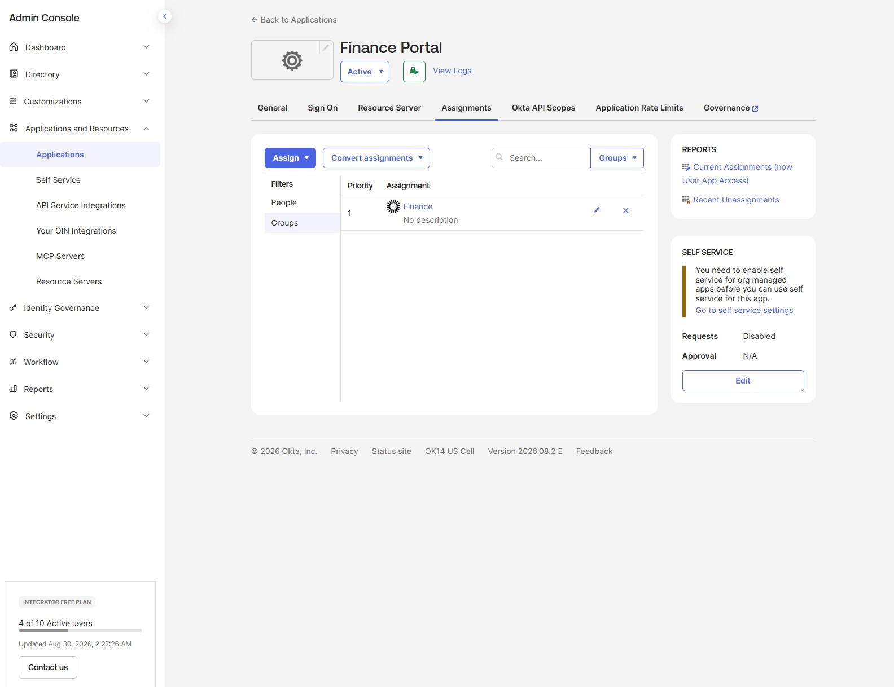
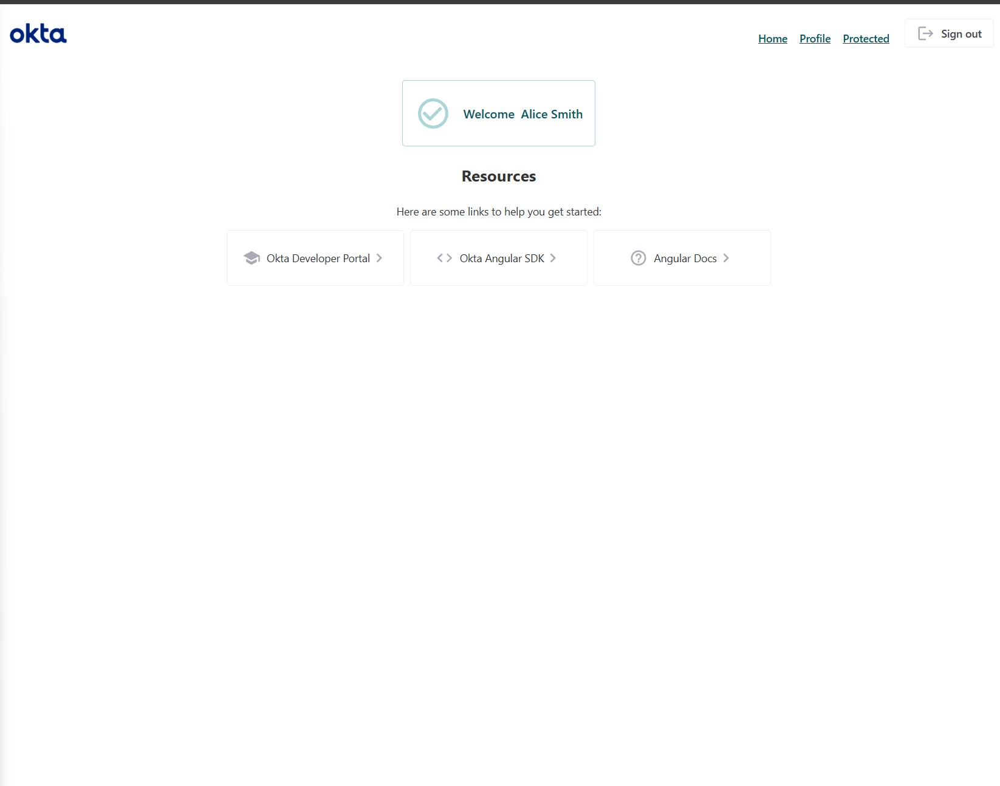
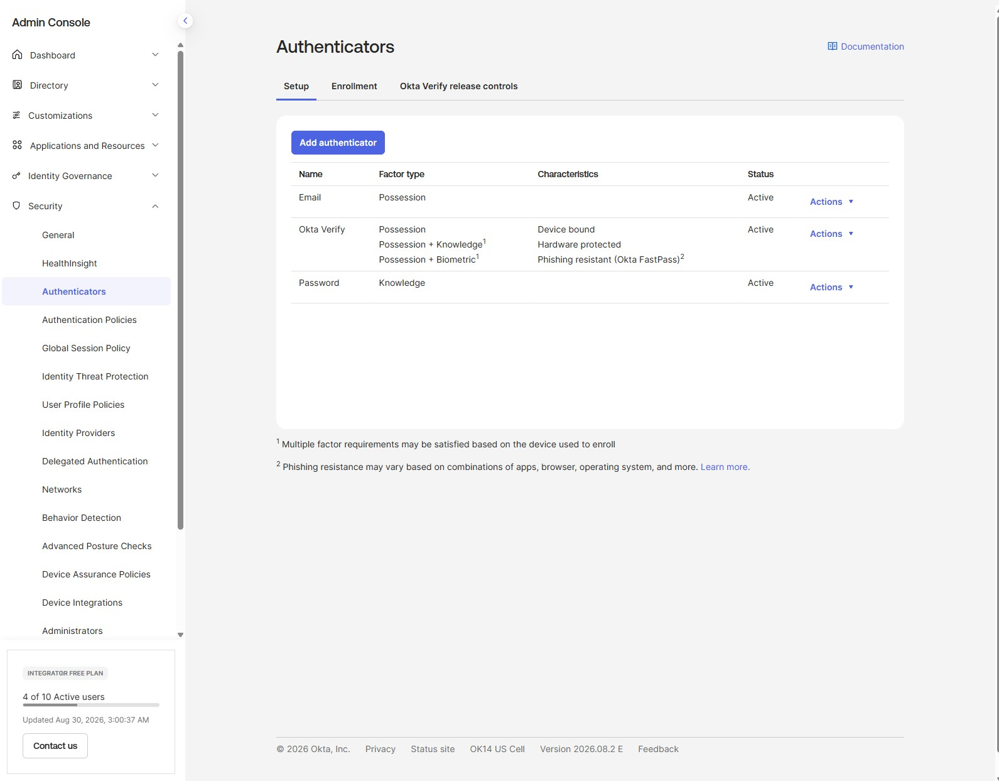
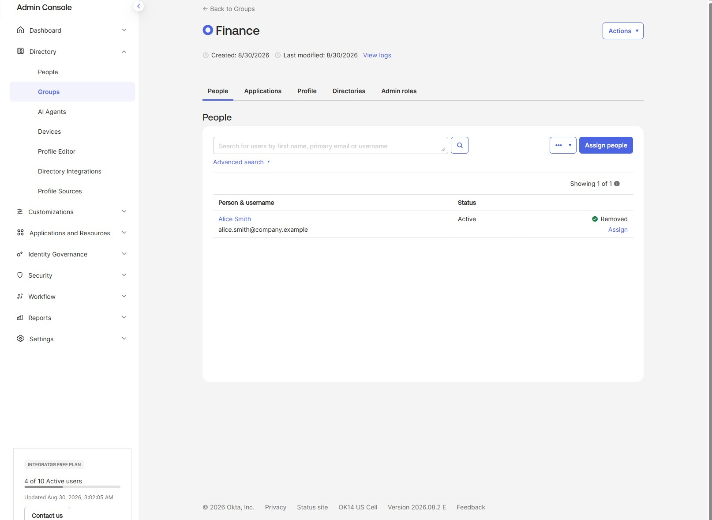

# Okta Workforce IAM Lab


A hands-on identity and access management administration lab that models workforce access to a fictional Finance Portal using Okta groups, OIDC single sign-on, MFA, and access revocation.

## Overview

The lab simulates a common workforce IAM requirement: only Finance employees should be able to use a Finance Portal. Access is managed through group assignment rather than assigned individually to each user. The walkthrough validates both sides of the control: successful access for an assigned Finance user and denial after that user's Finance-group membership is removed.

This repository documents Okta administration and configuration work. It is not a custom application-development project.

## Business problem

Finance data should be available only to the people whose job function requires it. A scalable IAM model needs to grant access based on role or department, apply additional authentication controls, and revoke access promptly when a person's role changes.

This lab uses the Finance group as the access-control point for the Finance Portal. Alice receives the application through Finance membership; removing that membership removes her assignment and prevents a new authentication flow from completing.

## Platforms and technologies

- Okta Workforce Identity Cloud
- Okta Universal Directory users and groups
- Okta OIDC Single-Page Application integration
- Authorization Code flow with PKCE
- Refresh token grant
- Okta Verify MFA
- Default Okta authorization server and client access policy
- Okta's official Angular quickstart sample, used only as a local OIDC validation harness

The Angular quickstart was not developed or copied into this repository. It was used locally to verify the configured OIDC redirect flow end to end.

## Logical architecture


Access control is handled through Okta's directory, groups, application assignment, and authorization policies. See [docs/architecture.md](docs/architecture.md) for the logical flow.

## User, group, and access model

| User | Department group | Baseline group | Finance Portal access |
| --- | --- | --- | --- |
| Alice | Finance | All Employees | Yes, through Finance |
| Bob | Engineering | All Employees | No |
| Charlie | HR | All Employees | No |

The Finance group is assigned to Finance Portal. The application assignment therefore follows group membership rather than direct, per-user assignment. See [docs/access-model.md](docs/access-model.md).

## Test scenario

1. Created fictional workforce users: Alice, Bob, and Charlie.
2. Created All Employees, Finance, HR, and Engineering groups.
3. Added each user to All Employees and their department group; Alice was added to Finance.
4. Created the Finance Portal OIDC Single-Page Application integration.
5. Enabled Authorization Code with PKCE and refresh tokens.
6. Configured a default authorization-server access policy for the Finance Portal client.
7. Assigned the Finance group to Finance Portal.
8. Configured Okta Verify as an MFA authenticator.
9. Signed in as Alice through Okta's official Angular quickstart validation harness and confirmed successful SSO.
10. Removed Alice from Finance and retried authentication.
11. Confirmed access was denied with: `User is not assigned to the client application`.

## SSO authentication flow


1. The local Angular quickstart sends the browser to Okta using an OIDC redirect.
2. Okta evaluates the Finance Portal client, Alice's assignment through Finance, and the applicable access policy.
3. Okta prompts for authentication and Okta Verify MFA as required.
4. On success, Okta returns the browser to the registered callback URI with an authorization response.
5. The sample completes the Authorization Code with PKCE flow and establishes the local application session.

The configured refresh-token capability supports token renewal without requiring a full interactive sign-in each time, subject to the application's policy and token lifetime settings.

## MFA

Okta Verify was enabled as an authenticator in the lab. MFA adds a possession-based factor to the sign-in process, reducing the risk of account compromise from a password alone. This lab documents authenticator configuration; it does not expose enrollment QR codes, recovery codes, devices, or credentials.

## Group-based access control and revocation

The Finance group is the entitlement boundary for Finance Portal. This demonstrates a practical group-based access control model:

- Add a user to Finance to grant the application assignment.
- Remove a user from Finance to revoke the application assignment.
- Avoid maintaining separate direct assignments for each Finance user.

The revocation test confirmed that after Alice was removed from Finance, a new sign-in attempt was denied because she was no longer assigned to the client application.

## Evidence

### Finance group assigned to Finance Portal



### Successful SSO validation

Alice successfully completed the local OIDC flow through Okta's official Angular quickstart test harness.



### Okta Verify configured



### Finance access removed



The final denial was confirmed during the lab: `User is not assigned to the client application`. The corresponding browser screenshot is intentionally not published because its address bar contains tenant information and a state token.

## IAM concepts demonstrated

- Workforce identity lifecycle administration
- User and group management
- Group-based application assignment
- Least-privilege access through department-based entitlements
- OIDC single sign-on
- Authorization Code flow with PKCE
- Refresh tokens
- MFA with Okta Verify
- Authorization-server access policies
- Access revocation and denial validation
- Audit-friendly, repeatable access testing

## Limitations

- The users, groups, and Finance Portal are fictional lab objects.
- The Angular application is an official Okta sample used solely for local validation; it is not included here.
- This lab does not implement automated joiner/mover/leaver workflows, HR integrations, SCIM provisioning, or production monitoring.
- The screenshots document selected controls and outcomes, not every tenant configuration screen.

## Future improvements

- Add group rules driven by department attributes.
- Integrate an HR source and automate joiner, mover, and leaver changes.
- Add SCIM provisioning and deprovisioning to downstream applications.
- Define stronger sign-on policies for sensitive applications.
- Add access reviews, recertification, and audit reporting.
- Test group claims and API authorization with a protected resource server.

## Repository structure

```text
okta-workforce-iam-lab/
├── README.md
├── docs/
│   ├── architecture.md
│   └── access-model.md
└── screenshots/
    ├── 04-finance-group-app-assignment.jpg
    ├── 05-okta-sso-success.jpg
    ├── 06-okta-mfa-configured.jpg
    └── 07-finance-access-revoked-group-removal.jpg
```
